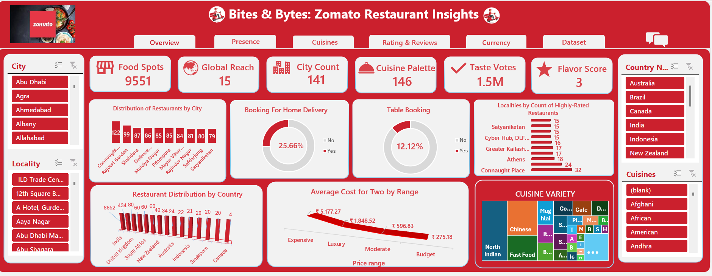
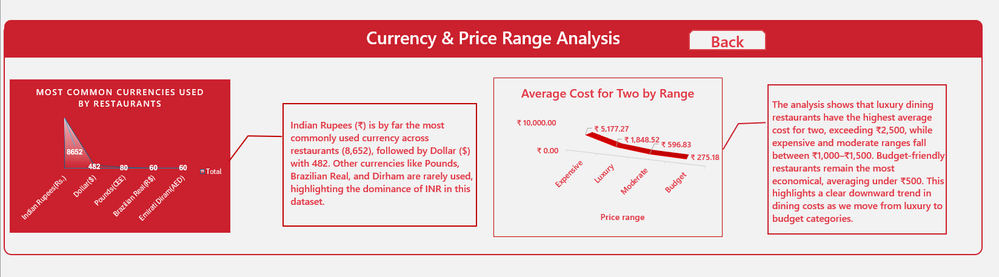
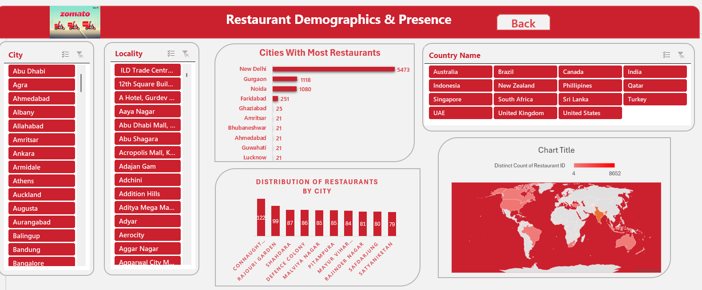
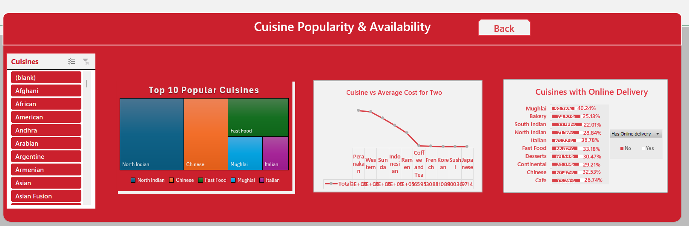
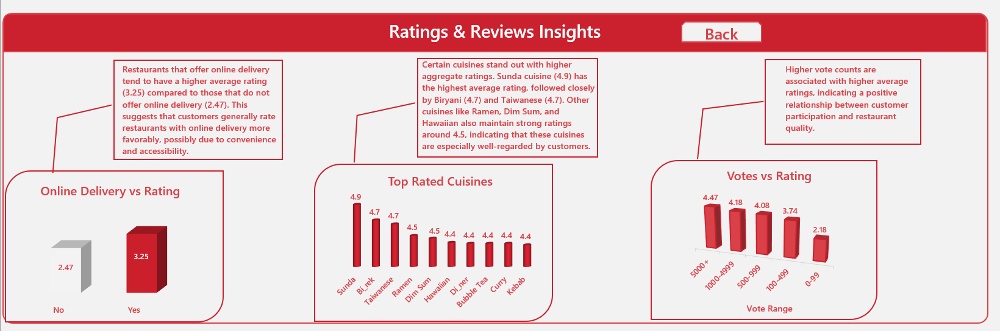
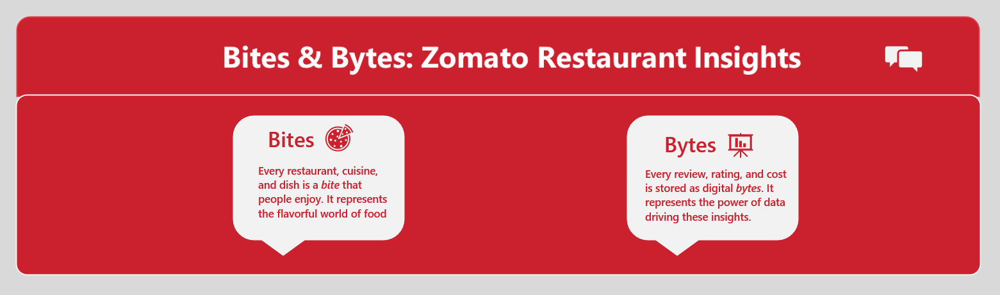

# 🍽️ Zomato Excel Dashboard

## 📊 Project Overview
This project presents an **Interactive Excel Dashboard** analyzing **Zomato restaurant data**.  
The dashboard provides deep insights into Zomato's business performance and customer preferences across different countries.

It is divided into six key sections:
1. **Overview** – Overall restaurant metrics and summary  
2. **Currency** – Analysis of pricing and transactions by currency  
3. **Presence** – Zomato’s global reach across countries and cities  
4. **Cuisines** – Most popular cuisines and their distribution  
5. **Ratings** – Average ratings and top-rated restaurants  
6. **Reviews** – Customer review trends and engagement patterns  

All visuals and calculations are built entirely in **Microsoft Excel** using formulas, charts, slicers, and pivot tables.

---

## 🧰 Tools & Techniques Used
- **Microsoft Excel**
  - Pivot Tables & Charts  
  - Slicers for interactivity  
  - Data Cleaning & Formatting  
  - Conditional Formatting  
  - Lookup functions & formulas

---

## 📷 Dashboard Preview

### 1️⃣ Overview

### 2️⃣ Currency

### 3️⃣ Presence

### 4️⃣ Cuisines

### 5️⃣ Ratings

### 6️⃣ Reviews

> *(Make sure your screenshots are stored in a `screenshots` folder inside the repository.)*

---

## 💡 Key Insights
- Zomato operates across multiple countries with diverse currencies.  
- Popular cuisines vary significantly by region, with some globally trending cuisines.  
- High-rated restaurants often align with specific cuisine types.  
- Customer reviews reveal valuable feedback patterns useful for business strategy.  

---

## 🚀 How to Use
1. Download the Excel file from this repository.  
2. Open it in Microsoft Excel (desktop version recommended).  
3. Use the slicers and filters to interact with the dashboard and explore different insights.  

